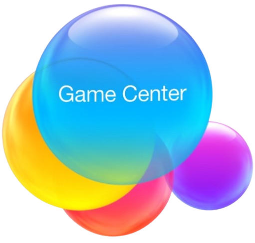

<div align="center">
  <br />
 <p>
    <a href="#"></a>
</p>

  <h2 align="center"><a href="https://github.com/yusufinann/GameHub">Game Center Game Platform</a></h2>

  <p align="center">
    Web-Based Live Game and Social Interaction Platform 🚀
    <br />
    Discover Fun with Bingo, Hangman, and More! 🎲🔠
    <br />
    <a href="#project-summary"><strong>Project Summary</strong></a>
    ·
    <a href="#key-features"><strong>Key Features</strong></a>
    ·
    <a href="#technology-stack"><strong>Technology Stack</strong></a>
    ·
    <a href="#advanced-resilience--performance-with-redis"><strong>Advanced Resilience & Performance</strong></a>
    ·
    <a href="#application-features-screen-based"><strong>Application Features</strong></a>
    ·
    <a href="#installation-and-setup"><strong>Installation and Setup</strong></a>
  </p>
</div>

---

<h2 id="project-summary">✨ Project Summary</h2>

Game Center Game Platform is a **web-based dynamic game center** that offers players the opportunity to experience various games and socialize with friends from the comfort of their homes. Our platform now offers both **Bingo** and the classic word-guessing game, **Hangman**, as foundational experiences, with plans to incorporate **various new and exciting games** in the future. Our goal is to provide our users not only with a platform to play games but also a place where they can **socialize in a live, interactive, and enjoyable digital environment**. With our user-friendly interface, real-time gaming experience, rich social features, multi-language support, customizable themes, and robust backend, we promise players a **unique entertainment and community experience**.

---

<h2 id="key-features">🚀 Key Features</h2>

* **🕹️ Diverse Game Library:** Easy access to a growing collection of games, currently featuring Bingo and Hangman, designed to cater to various tastes.
* **👥 Social Interaction Focused:** Set up lobbies with friends, chat, and enjoy games together.
* **⚡ Real-Time Live Gaming Experience:** Instant updates, synchronized gameplay, and real-time competition powered by WebSocket.
* **🎨 User-Friendly and Stylish Interface:** Modern and intuitive design built with React and Material UI.
* **📱 Fully Responsive Design:** Seamless experience on desktop, tablet, and mobile devices.
* **🌈 Customizable Theme Options:** Personalize your experience with theme choices including Light, Dark, and an attractive modern **Neon-Ocean** theme.
* **🌐 Multi-Language Support:** Reaching a wide audience with English and Turkish language options.
* **🔔 Smart Notification System:** Instant notifications for events, invitations, game turns, and updates.
* **📊 Detailed Player Profile:** Personal development tracking with statistics, game history, friends, and achievements.
* **💬 Community and Chat Areas:** Building a player community with global and private group chats, optimized for performance.
* **🔠 Interactive Hangman Multiplayer:** Guess words together or competitively, see opponents' progress in real-time, and chat within the game lobby.
* **🔄 Concurrent Gameplay & Turn Notifications:** Engage in multiple games across different lobbies simultaneously. Receive timely notifications for your turn in turn-based games, even when you're not in the active lobby.
* **🛡️ Uninterrupted Gameplay with Redis:** Active games persist through backend restarts or temporary disruptions, allowing players to resume exactly where they left off.

---

<h2 id="technology-stack">🛠️ Technology Stack</h2>

Our application is built on modern and powerful web technologies:

### Frontend

* **⚛️ React:** Component-based, modular, and reusable interface development.
* **🗺️ react-router-dom:** Smooth and dynamic page routing and navigation.
* **📡 Axios:** HTTP client for reliable and fast Backend API communication.
* **🎨 Material UI:** Aesthetics and functionality with a rich, modern, and customizable UI components library (supports theming like Light/Dark/Neon-Ocean modes).
* **📦 React Context:** Efficient and easy state management throughout the application.
* **🚀 React-Window:** High-performance list virtualization for smooth scrolling in large chat histories.

### Backend

* ** NodeJS:** High performance, event-driven, and scalable server-side development.
* **🚄 Express:** Fast, flexible, and minimalist web application and API development framework.
* ** MongoDB:** NoSQL database offering flexible schema, high performance, and scalability for persistent data.
* **🌱 Mongoose:** Elegant and powerful Object Data Modeling (ODM) library for MongoDB.
* **🔑 Jsonwebtoken:** Secure authentication and authorization with industry-standard JWT (JSON Web Token).
* **🔒 express-session & connect-redis & Memorystore:** Secure and efficient session management solutions, with Redis enhancing session persistence.
* ** Redis:** In-memory data store used for caching, session management, and ensuring active game state persistence and resilience.
* **🛡️ bcrypt:** Security of sensitive data with one-way encryption.
* **📦 body-parser & cookie-parser:** Easily processing HTTP request data and cookies.
* **🔄 Cors:** Secure Cross-Origin Request Management.
* **⚙️ Dotenv:** Managing environment variables in an organized and secure way.

### Other Tools

* **🕸️ WebSocket:** Real-time, two-way, and low-latency communication channel.
* **🏗️ Lerna:** Monorepo management and optimizing package dependencies in large projects.
* **🛠️ craco:** Easy React configuration customization tool.
* ** Git:** Distributed version control system for team collaboration and code management.

---

<h2 id="advanced-resilience--performance-with-redis">🚀 Advanced Resilience & Performance with Redis</h2>

Our platform leverages Redis to deliver an exceptionally stable and responsive gaming experience, ensuring that active game sessions are shielded from backend disruptions and UI inconsistencies.

*   **🛡️ Hybrid Cache for Active Game Continuity:**
    *   Critical in-game data, such as player moves and current scores, are stored in Redis Hashes. This provides instantaneous access and decouples active gameplay from direct backend dependencies.
    *   While final game outcomes are persisted to MongoDB for long-term storage, interim final scores are also cached in Redis with a 15-minute TTL. This strategy ensures quick access to recent results and automatic cleanup of stale data, with the TTL resetting upon new game starts.

*   **⏱️ Resilient Timers (e.g., Bingo Auto-Draw):**
    *   Game-critical timers, like the 3s/5s/10s auto-draw intervals in Bingo, are meticulously managed and persisted in Redis.
    *   Should the backend restart, these timer states are recovered, allowing games to resume seamlessly from their exact point of interruption, preventing frustrating "game freezes."

*   **💻 Durable UI State Management:**
    *   Key UI states, such as active modals or game-specific interface elements, are temporarily cached in Redis with a short TTL (e.g., 15 minutes).
    *   This overcomes the inherent fragility of React's local state/useRef against page refreshes or unexpected UI crashes, preventing data loss and ensuring a consistent user experience.

*   **🧠 Smart Cache & Performance Optimization:**
    *   Utilizing Redis's `maxmemory-policy allkeys-lru` (Least Recently Used) eviction policy ensures efficient memory management.
    *   This architecture has been proven to maintain state consistency and deliver low latency, even under stress tests with 150+ concurrent users and simulated server restarts.

🎯 **Key Outcomes of Redis Integration:**

*   💥 **Maximum Durability:** Near-complete immunity to backend issues affecting live gameplay.
*   ⚡ **High Performance:** Lightning-fast responses for in-game interactions.
*   🧠 **Optimized Resource Usage:** Intelligent TTL management prevents unnecessary memory overhead, keeping the system lean and efficient.

---

<h2 id="application-features-screen-based">🎮 Application Features (Screen-Based)</h2>

<div align="center">
  <p><strong>✨ QUICK JUMP: DISCOVER OUR SCREENS ✨</strong></p>
  <p>
    <a href="#login-screen-page" style="display: inline-block; text-decoration: none; margin: 5px; padding: 10px 18px; border-radius: 25px; background-color: #1a2533; color: #87CEEB; border: 1px solid #87CEEB; font-weight: 500;">🚪 Login Screen</a>
    <a href="#main-screen-page" style="display: inline-block; text-decoration: none; margin: 5px; padding: 10px 18px; border-radius: 25px; background-color: #1a2533; color: #87CEEB; border: 1px solid #87CEEB; font-weight: 500;">🏠 Main Screen</a>
    <a href="#settings-screen-page" style="display: inline-block; text-decoration: none; margin: 5px; padding: 10px 18px; border-radius: 25px; background-color: #1a2533; color: #87CEEB; border: 1px solid #87CEEB; font-weight: 500;">⚙️ Settings Screen</a>
  </p>
  <p>
    <a href="#game-detail-page" style="display: inline-block; text-decoration: none; margin: 5px; padding: 10px 18px; border-radius: 25px; background-color: #1a2533; color: #87CEEB; border: 1px solid #87CEEB; font-weight: 500;">ℹ️ Game Detail</a>
    <a href="#game-screen-page" style="display: inline-block; text-decoration: none; margin: 5px; padding: 10px 18px; border-radius: 25px; background-color: #1a2533; color: #87CEEB; border: 1px solid #87CEEB; font-weight: 500;">🎮 Game Screen</a>
    <a href="#profile-screen-page" style="display: inline-block; text-decoration: none; margin: 5px; padding: 10px 18px; border-radius: 25px; background-color: #1a2533; color: #87CEEB; border: 1px solid #87CEEB; font-weight: 500;">👤 Profile Screen</a>
  </p>
  <p>
    <a href="#community-screen-page" style="display: inline-block; text-decoration: none; margin: 5px; padding: 10px 18px; border-radius: 25px; background-color: #1a2533; color: #87CEEB; border: 1px solid #87CEEB; font-weight: 500;">🏘️ Community</a>
    <a href="#conversation-screen-page" style="display: inline-block; text-decoration: none; margin: 5px; padding: 10px 18px; border-radius: 25px; background-color: #1a2533; color: #87CEEB; border: 1px solid #87CEEB; font-weight: 500;">💬 Conversation</a>
  </p>
  <p><em>(Note: "Game Screen" covers specifics for Bingo, Hangman, etc.)</em></p>
</div>
<br/>

---

<h3 id="login-screen-page">🚪 Login Screen</h3>

* **🔑 Secure Login with Email & Password:** Standard and reliable user authentication.
* **🍪 "Remember Me" Option:** Fast and automatic login with cookies.
* **❓ "Forgot Password" Function:** Easy password reset via email.
* **🔒 Secure Session Management with JWT & Redis:** Securely storing user information and session in LocalStorage, with Redis enhancing session persistence across server instances.
* **🔄 Automatic Token Check:** Seamless login experience every time the page loads.
* **👤 Quick Login Avatar:** Personalized quick login with the "Remember Me" option.

<h3 id="main-screen-page">🏠 Main Screen</h3>

* **🚪 Lobby Listing:** Dynamically listing active game lobbies (game type like Bingo or Hangman, status, encryption).
* **🎨 Animations and Visual Richness:** Interactive elements that make the interface lively and user-friendly.
* ** Left Fixed Menu (Sidebar):** Easy access for main navigation (Main Screen, Games, Community, Chat, Profile).
* ** Right Fixed Friend List (Sidebar):** Online friends and quick social interaction.
* **🖼️ Animated Slideshow:** Dynamic presentation of platform and game promotions.
* **🔍 User Search Area:** Quickly finding user profiles and sending friend requests.
* **👤 Profile Icon:** Instant access to personal profile.
* **🔔 Notification Icon:** Instant notifications for important updates and interactions.
* ** Lobby Type Tabs:** Easy filtering with "All Lobbies", "Normal", "Event", "Lobbies I'm In".
* **🔒 Encrypted/Open Lobby Distinction:** Quick visual recognition with lock icons.
* **⏱️ Event Lobby Time Indicator:** Countdown or date information for event start.
* **✨ Animated Lobby Elements:** Visually appealing and interactive lobby list.
* **🛠️ Lobby CRUD Operations:** User management of their own lobbies (create, update, delete).
* **🚪 "Enter Lobby You Are In" Button:** One-click access to registered lobbies.
* **➕ "Create Lobby" / "Go to Your Lobby" Buttons:** Creating a new lobby or redirecting to an existing lobby.

### ➕ Create Lobby Area

* ** Create Lobby Modal:** Configuring all lobby settings from a single place.
* **📝 Lobby Name (Required):** Unique name that defines the lobby.
* **🎲 Game Selection (Dropdown):** Easily selecting the game type to be played (e.g., Bingo, Hangman).
* ** Lobby Type Selection (Radio Buttons):** Determining "Normal" or "Event" lobby type.
    * ** Normal Lobby:** Always open and always playable.
    * ** Event Lobby:** Planned events with a specific time range.
* **👥 Number of Members (Dropdown, Required):** Maximum number of players that can join the lobby.
* ** Lobby Password (Optional):** Option to create a private and secure lobby.
* **❌ "Cancel" & ✅ "Create Lobby" Buttons:** Easily managing the process.
* **🎉 "Lobby Created Successfully" Screen:** Information with lobby code, link, and sharing tools.
* ** Lobby Code:** Easy lobby sharing with a unique code and copy icon.
* **🔗 Lobby Link:** Direct participation link and quick copy option.
* **👤 Lobby Members List:** Instant viewing of participants (initially only host).
* ** Social Media Sharing Icons:** Quickly announcing the lobby on social platforms.
* ** "Close" Button.**
* **🚪 "Go to Your Lobby" Button:** Instant transition to the created lobby.

### ⚙️ Lobby Management

Our Game Platform offers users powerful and intuitive lobby management tools. There are various management features for both lobby creators (hosts) and players joining the lobby:

#### ➕ Lobby Creation and Types

* **🎨 Lobby Creation Modal:** Easily configure lobby settings with a user-friendly modal interface.
* **📝 Lobby Name:** Specify a custom name that defines your lobby (required).
* **🎲 Game Selection:** Select the type of game you want to play (e.g., Bingo, Hangman).
* ** Lobby Types:** Choose the lobby type that suits your needs:
    * ** Normal Lobbies:**
        * Lobbies that remain open continuously, where you can play games whenever you want.
        * You can meet up with your friends or other players and enjoy gaming at any time.
    * ** Event Lobbies:**
        * Ideal for pre-planned events. They have a specific start and end time.
        * Event lobbies are perfect for organizing tournaments or special game events.
        * The event start time is clearly indicated to players with a countdown timer.
        * If there are more than 24 hours until the event, the event start date is shown; if there are less than 24 hours, a countdown timer is displayed.
* **👥 Maximum Number of Members:** Determine how many players can join your lobby (required).
* ** Optional Password Protection:** Make your lobby private and exclusive to people who know the password.

#### 🚪 Lobby Listing and Joining

* **🚪 Dynamic Lobby List:** View active lobbies in real-time on the main screen.
* ** Lobby Filtering Tabs:** Filter the lobby list by type:
    * **"All Lobbies":** Shows all active lobbies on the platform.
    * **"Normal":** Lists only normal type lobbies.
    * **"Event":** Displays only event lobbies.
    * **"Lobbies I'm In":** Shows only the lobbies you are a member of.
* **🔒 Encrypted/Open Lobby Indicators:** Easily distinguish whether lobbies are encrypted or not with lock icons.
    *  Orange lock icon: Encrypted lobby.
    *  Green lock icon: Unencrypted lobby.
* **⏱️ Event Time Indicator:** Track the start time and countdown in event lobbies.
* **✨ Visual Lobby Elements:** Animated and moving elements that make lobbies more attractive.
* **🚪 "Join" Button:** Join any lobby from the list with a single click.
* **🔗 Joining with Lobby Link:** Easily access the lobby directly with a lobby invitation link.

#### 👑 Lobby Manager (Host) Capabilities

Lobby creators can keep their lobbies under full control:

* **🛠️ Lobby Editing:** Update your created lobby settings (name, type, number of members, password) at any time.
    * Open the modal with the edit icon in the lobby list and make changes.
    * Receive instant notification after successful update.
* **🗑️ Lobby Deletion:** Delete your created lobby completely at any time.
    * Permanently remove the lobby with the delete icon in the lobby list.
* **🚫 Kick Player (USER_KICKED):** The host has the authority to remove any player from their lobby at any time. This action immediately removes the player from the lobby and any active game within it.
* **⏳ Automatic Lobby Deletion (Normal Lobbies):** In normal lobbies, if the host leaves the lobby and does not return within 8 hours, the lobby is automatically deleted. This efficiently utilizes system resources and prevents unnecessary lobby clutter.
* **🎮 Game Control:** As the host, you have the authority to start the game, choose the game mode (e.g., for Bingo: draw speed, competition style; for Hangman: word category, difficulty), and guide your players for the best gaming experience.

#### 🚪 Player Lobby Management

Players can also take an active role within the lobby:

* **🚪 Leaving Lobby:** You can leave the lobby at any time.
* **🚀 "Go to Lobby I'm In" Button:** Quickly access the lobbies you are a member of from the main screen or your profile.

#### 🔔 Lobby Operations Notifications

Our platform supports your lobby management operations with instant notifications:

* **✅ Lobby Created Successfully:** Instant notification message after lobby creation.
* **✅ Lobby Updated Successfully:** Confirmation notification when lobby settings are updated.
* **🗑️ Lobby Deleted Notification:** Animated modal notification to players in the lobby when the lobby is deleted.
* **🚪 User Joined Lobby Notification:** Instant snackbar notification and notification icon update when a new player joins the lobby.
* **⏰ Event Start Notification:** Instant notification to members when event lobbies start.
* **⏳ Event Lobby Approaching End Warning:** Warning notification to players 5 minutes before the event time expires.

<h3 id="game-detail-page">ℹ️ Game Detail Page</h3>

* ** Game Modes and Rules:** Detailed descriptions for each game (e.g., Bingo: Classic, Extended, Super Fast; Hangman: Single Player, Multiplayer, Word Categories).
* ** Competition Styles:** Information about competitive and relaxed game styles.
* ** "How to Play?" Section:** Step-by-step simple game guide for new players for each game.
* ** Game History Section:** User's game history and performance statistics for each game (with pagination).
* **🚪 Active Lobby List (Game Page):** List of active lobbies specific to the selected game type (e.g., Bingo, Hangman).
* **➕ "Create Lobby" Button (Game Page):** Quick lobby creation shortcut for this game type.
* ** Animated Page Transition:** Smooth and visually rich user experience.

<h3 id="game-screen-page">🎲 Game Screen (Bingo Game)</h3>

Experience the thrill of Bingo with enhanced flexibility and visual appeal!

* **👑 Host Control:** Lobby creator's authority over game settings and starting.
* **⚙️ Flexible Draw Modes & Multiple Competition Styles (Min. 2 Players):**
    * **Draw Mechanics:** Choose between automatic number drawing or designate a player (often the host) to manually draw numbers.
    * **Speed Options:** Set the pace with 3s, 5s, or 10s drawing intervals for automatic draws.
    * **Competition Modes:**
        * **"Competitive":** Players earn points based on their ranking (1st to call Bingo, 2nd, etc.).
        * **"Contestant":** The first player to correctly call Bingo wins the round.
* **🎨 Dynamic Tickets & Visual Variety:** Each player automatically receives uniquely colored and laid-out Bingo tickets for every game, ensuring a fresh visual experience each time.
* **🚪 Easy User Participation:** Quick participation via lobby link, main screen, or game detail page.
* **🏁 Game Start:** Start by host and 5-second countdown timer.
* **⚡ Real-Time Gaming Experience:** Real-time and synchronized game flow.
* **🔊 In-Game Sound Control:** Option to turn sound effects on/off.
* **💬 In-Game Messaging (Chat):** Communication with animated chat area and emoji support.
* **😄 Quick Emoji Sending:** Ability to quickly express emotions.
* ** Game Area:** Basic interface of the Bingo game.
* **📣 "Call Bingo!" Button:** Button activated when Bingo is achieved.
* ** "Draw Number" Button (Manual Mode):** Manual number drawing control.
* **🔢 Drawn Numbers List:** Ability to track all drawn numbers.
* **🔥 Active Numbers Area:** Highlighting the latest drawn numbers.
* **🎫 Bingo Ticket (Your Ticket):** Player's personal bingo card.
* ** Card Selection:** Switching between multiple tickets.
* **🏆 Completing Players List:** Real-time list of players who have achieved Bingo.
* ** Game Over and Ranking Table:** Game results, ranking, and "Play Again" options.
* **💾 Game History Recording (Database & Redis Cache):** Game results are persisted in MongoDB, with recent final scores cached in Redis for quick access.
* **⏳ If Host Leaves Lobby (Normal Lobbies):** Lobby automatically closes if they do not return within 8 hours.

**Bingo in Event Lobby:**

* **⏱️ Event Timer:** Dynamically showing the time remaining until the event starts.
* **👑 Host Control (Event Lobby):** Event owner host's authority to start the game.
* **🔔 Event Start Notification:** Instant notification to lobby members when the event starts.
* **🚀 Starting Game in Event Lobby:** Start with game mode selection modal.
* ** Countdown and Game Start (Event Lobby):** Exciting start with a 3-second countdown.
* **🎲 Bingo in Event Lobby:** Same rich gaming experience as normal lobby.
* **💬 In-Game Snackbar Notifications:** Instant notifications during gameplay.
* **⏰ Event End Warning 5 Minutes Before:** Warning notification to players 5 minutes before the event time expires.
* ** Notifications to Users When Joining Game:** Instant notification when a new player joins.
* **❌ Incorrect Bingo Call Notification (Audible and Silent):** Instant feedback and buzzer sound in case of error.
* **🚪 User Joining Lobby Notification (Audible and Silent):** Instant notification when a new player joins the lobby.
* ** Notification When Lobby is Deleted (Animated Modal):** Animated notification when lobby is deleted or event ends.
    * **🗑️ Lobby Deleted by Host:** "Lobby No Longer Available" modal and countdown.
    * **⌛ Event Lobby Time Expired:** "Lobby No Longer Available" modal and countdown.

### 🔠 Game Screen (Hangman Game)

Engage in a classic word-guessing challenge with a modern, interactive twist and customizable gameplay!

* **👑 Host Control:** Lobby creator (host) can set game parameters and initiate the game.
* **🕹️ Multiple Game Modes:**
    * **Single Player:** Challenge yourself and aim for a high score or personal best.
    * **Turn-Based Multiplayer:** Compete against friends or collaborate in the same lobby, taking turns to guess letters.
* **📝 Dynamic Word Management:**
    * **Automatic Pool (TR/EN):** Words are randomly selected from a predefined pool supporting both Turkish and English.
    * **Host-Defined Custom Words:** The host can personalize the game by inputting their own custom words for an extra layer of fun and challenge.
* **🚪 Easy User Participation:** Join Hangman lobbies via lobby link, main screen, or game detail page.
* **🏁 Game Start & Countdown:** Game begins after host initiation, often with a short countdown for anticipation.
* **⚡ Real-Time Synchronized Experience:** All players see the game state (word progression, guessed letters) update simultaneously.
* **👀 Real-Time Opponent Progress (Multiplayer):** See the status of other players' Hangman figures or their progress in guessing, fostering a competitive or collaborative atmosphere.
* **💬 In-Game Messaging (Chat):** Strategize, tease, or cheer with the integrated chat, complete with emoji support.
* **⌨️ Interactive Game Area:**
    * **Word Display:** See the hidden word represented by blanks.
    * **Hangman Figure:** Watch the Hangman figure build with each incorrect guess.
    * **Letter Selection:** An on-screen keyboard or input method to guess letters.
    * **Guessed Letters:** Track correct and incorrect letters already chosen.
* **🔊 In-Game Sound Control:** Option to turn sound effects for guesses and game events on/off.
* **🏆 Win/Loss Conditions:** Clear indication of winning (guessing the word) or losing (completing the Hangman figure).
* **📊 Game Over and Results:** Display of the correct word, individual/team scores (if applicable), and options to "Play Again."
* **💾 Game History Recording (Database & Redis Cache):** Game outcomes and relevant stats are saved to player profiles, with recent scores cached in Redis.
* **⏳ Host Departure (Normal Lobbies):** If the host leaves a normal lobby, it may automatically close after a certain period (e.g., 8 hours) if they don't return.
* **🔔 In-Game Notifications:**
    * **User Joined/Left Lobby:** Audible and/or visual cues.
    * **Correct/Incorrect Guess:** Visual feedback and optional sound.
    * **Game Won/Lost:** Clear notifications for game end-states.
    * **Your Turn Notification:** In turn-based multiplayer, players are notified when it's their turn to guess, even if not actively in the lobby.
    * **Event Lobby Specifics:** Timers and start/end notifications similar to Bingo event lobbies.

<h3 id="profile-screen-page">👤 Profile Screen</h3>

* **👤 User Profile Information:** Basic information such as name, level, location, membership date, level progress.
* **📊 Game General Statistics:** Total games, wins, average score, win rate, longest streak (summary and graphs) for each game played (e.g., Bingo, Hangman).
* ** Game History (e.g., Bingo, Hangman):** Detailed list of games played for each game type (regular display with pagination).
* ** Friends List:** Viewing current friends.
* ** Achievements:** Visual display of earned achievements (potentially game-specific achievements too).
* **➕ Send/Add Friend Request:** "ADD FRIEND" button and status indicator.
* ** Manage Friend Requests:** Accept/reject with "Friend Requests" modal.
* ** Remove Friend:** "REMOVE FRIEND" button and confirmation modal.

<h3 id="community-screen-page">🏘️ Community Screen</h3>

* ** Global Community (Common Message Area):** General chat channel where all players can participate.
* ** Community Groups (Private Groups):** Area where users can create private chat groups.
    * ** "MY GROUPS":** Groups the user is a member of.
    * ** "JOIN GROUPS":** List of existing groups to join.
* **➕ Create Group:** Group creation modal with "+" icon in "MY GROUPS" section.
* **🚪 Join Group:** Joining groups listed in "JOIN GROUPS" section with "JOIN" button.
* **🔗 Group Link Invitation:** Ability to create and share group invitation link.
* **🚪 Leave Group:** "Leave Group" option from "..." menu in "MY GROUPS" section.
* **🗑️ Delete Group:** "Delete Group" option from "..." menu in "MY GROUPS" section (host only).
* **⚡ Real-Time Chat (WebSocket):** Instant messaging experience.
* **💬 Optimized Chat Performance with Virtualization (React-Window & Pagination):**
    *   **React-Window for Efficient Rendering:** In long message lists, only the currently visible message components are rendered in the DOM. Off-screen items are removed, significantly reducing browser load and ensuring exceptionally smooth scrolling.
    *   **Backend Skip/Limit Pagination:** Messages are initially fetched in batches (e.g., `limit=30`, `skip=0`). As the user scrolls upwards, new batches are requested with an incremented `skip` value (`skip += 30`). This minimizes network traffic and initial load times by avoiding fetching all messages at once.
    *   **Synchronized Virtualization & Pagination:** React-Window's "virtual windowing" displays only visible items. When the scroll position reaches the top (scrollTop = 0), a backend call fetches the next batch of older messages, which are then prepended to the list and dynamically integrated into the virtualized view.
    *   ⚡ **Performance Gains:**
        *   **Reduced DOM Node Count:** Keeps the number of active DOM elements low (typically 30-50), freeing up browser resources.
        *   **Minimized Network Load:** Step-by-step loading of message batches prevents network congestion.
        *   **Fluid Scroll & Superior UX:** Millisecond-level addition/removal of messages eliminates jank and provides a seamless user experience.
* ** Last 12 Hours Chat History (Global Community):** Full chat history is stored and accessible in Community Groups.
* **♻️ Reusable ChatBox Component:** Reusable chat box.
* **⏱️ Timing Indicator (ChatBox):** Displaying message times in a user-friendly format.
* **😄 Emoji Support:** Emoji usage in chats.
* **👥 Member List (Group):** Viewing member list in modal by clicking on group title.
* **🔍 Group Search (in JOIN GROUPS section):** Searching by group names.
* ** Group Encryption (Optional):** Password protection for private groups.
* **👑 Group Host Management:** Host permissions and automatic host transfer.
* **🗑️ Group Automatic Deletion:** Automatic deletion of the group when no members remain.
* **💬 Group Operations Notifications (Snackbar):** Instant notifications about group operations.

<h3 id="conversation-screen-page">💬 Conversation Screen</h3>

* ** "All, Friends, Friend Groups" Tabs:** Categorizing chat types and easy access.
    * ** "All":** Combined view of all chats.
    * ** "Friends":** Only one-on-one friend chats.
    * ** "Friend Groups":** Only friend group chats.
* ** Private Chat with Friends (One-on-One):** Private messaging in "Friends" tab.
* ** Create and Manage Friend Groups:** Group creation and management tools in "Friend Groups" tab.
* **➕ Create Group:** "+ CREATE GROUP" button and friend group creation modal.
* **🚪 Join Group:** "Friend Group Invitations" modal and group link join options.
* **🔔 Group Invitation Notification:** Invitation notifications with snackbar and notification icon.
* **🔗 Join Group via Link:** Creating and sharing invitation link.
* **🚪 Leave Group:** "Leave Group" option from "..." menu in "Friend Groups" tab.
* **🗑️ Delete Group:** "Delete Group" option from "..." menu in "Friend Groups" tab (host only).
* **👉 Guidance to Start Chatting:** Guide message on initial opening.
* **🚀 Chat Performance:** Benefits from the same React-Window virtualization and backend pagination as the Community Screen for fluid conversations.

<h3 id="settings-screen-page">⚙️ Settings Screen</h3>

*   ** In-App Theme Selection (Light/Dark/Neon-Ocean):** Easily switch between Light, Dark, and a stylish Neon-Ocean theme to suit your preference.
*   ** In-App Language Selection:** Choose your preferred language (English/Turkish) for the application interface.
*   ** Game Sound Management:** Control and adjust game sound effects volume or mute them entirely.
*   ** Sidebar Theme Control:** The theme can also be conveniently controlled directly from the sidebar.
  
---

<h2 id="installation-and-setup">🔧 Installation and Setup</h2>

Follow these steps to get the Game Center running on your local machine:

### Prerequisites

*   **Node.js:** Ensure you have Node.js (v16 or higher recommended) and Yarn installed.
*   **Git:** Required for cloning the repository.
*   **MongoDB:** You need a running instance of MongoDB (local or cloud).
*   **Redis:** You need a running instance of Redis (local or cloud).
*   **(Optional) API Client:** A tool like [Postman](https://www.postman.com/) or [Insomnia](https://insomnia.rest/), or familiarity with `curl` command line tool to create initial users.

### Steps

1.  **Clone the Repository:**
    ```bash
    git clone https://github.com/yusufinann/GameHub.git
    cd GameHub
    ```

2.  **Install Dependencies:**
    Install dependencies for the entire project from the root directory using Yarn. This command will install dependencies for all packages within the monorepo (including backend and frontend).
    ```bash
    yarn install
    ```

3.  **Configure Backend Environment Variables:**
    *   Navigate to the backend package directory: `cd backend`.
    *   **Create a `.env` file** in this `backend` directory.
    *   Copy the structure below and **replace values with your own configuration**:

        ```dotenv
        PORT=3001
        FRONTEND_URL=http://localhost:3000
        MONGO_DB_URI=YOUR_MONGO_DB_CONNECTION_STRING_HERE
        REDIS_HOST=localhost
        REDIS_PORT=6379
        REDIS_PASSWORD=
        SESSION_SECRET=your_strong_random_session_secret_key 
        JWT_SECRET=your_different_strong_random_jwt_secret_key
        ```
    *   Set your `MONGO_DB_URI`, `REDIS_HOST`, `REDIS_PORT`, `REDIS_PASSWORD` (if applicable), `SESSION_SECRET`, and `JWT_SECRET`.
    *   Return to the root directory: `cd ..`.

4.  **Configure Frontend (game-center) Environment Variables:**
    To customize the API and WebSocket endpoints for the `game-center` application, create a `.env` file in the `packages/game-center/` directory.

    **Example `packages/game-center/.env` file:**
    ```dotenv
    REACT_APP_API_BASE_URL=http://your-backend-api-url:port
    REACT_APP_WS_BASE_URL=ws://your-backend-ws-url:port
    ```
    If this `.env` file is not created, or if these variables are not set within it, the `game-center` application will use the following default URLs:
    *   Default API Base URL: `http://localhost:3001`
    *   Default WebSocket Base URL: `ws://localhost:3001`

    **Note:** After creating or modifying this `.env` file, you may need to restart the frontend development server (e.g., `yarn workspace game-center start`) for the changes to take effect.

5.  **Ensure MongoDB and Redis are Running:**
    Make sure your MongoDB server instance (specified in `backend/.env`) and Redis server instance (specified in `backend/.env`) are running and accessible.

6.  **Run the Development Servers (from Root Directory):**

    *   **To run the Backend Server:**
        Open a terminal in the **root directory** (`GameHub/`).
        ```bash
        yarn workspace backend start 
        ```
        The backend server should now be running (e.g., on `http://localhost:3001`). **Keep this terminal window open.**

    *   **To run the Frontend Application (game-center):**
        Open a **new terminal window** in the **root directory** (`GameHub/`).
        ```bash
        yarn workspace game-center start
        ```
        The application should open automatically in your browser, typically at `http://localhost:3000`. If you created/modified `packages/game-center/.env`, you might need to stop and restart this command.

7.  **(IMPORTANT) Create Sample Users:**
    *   Send **POST** requests to your running backend (e.g., `http://localhost:3001/api/users/`).
    *   Set `Content-Type` header to `application/json`.
    *   Use the following JSON data in the request body for each user:

        **User 1:**
        ```json
        {
          "email": "user1@example.com",
          "password": "password1",
          "name": "John Doe",
          "username": "johndoe",
          "avatar": "https://mighty.tools/mockmind-api/content/human/112.jpg"
        }
        ```
        **User 2:**
         ```json
        {
          "email": "user2@example.com",
          "password": "password2",
          "name": "Jane Smith",
          "username": "janesmith",
          "avatar": "https://mighty.tools/mockmind-api/content/human/79.jpg"
        }
        ```
        **User 3:**
        ```json
        {
          "email": "user3@example.com",
          "password": "password3",
          "name": "Alice Johnson",
          "username": "alicejohnson",
          "avatar": "https://mighty.tools/mockmind-api/content/human/124.jpg"
        }
        ```
        **User 4:**
        ```json
        {
          "email": "user4@example.com",
          "password": "password4",
          "name": "Bob Brown",
          "username": "bobbrown",
          "avatar": "https://mighty.tools/mockmind-api/content/human/102.jpg"
        }
        ```
        **User 5:**
        ```json
        {
          "email": "user5@example.com",
          "password": "password5",
          "name": "Charlie Davis",
          "username": "charliedavis",
          "avatar": "https://mighty.tools/mockmind-api/content/human/5.jpg"
        }
        ```
    *   Ensure you get a successful response (e.g., 201 Created) for each user.

### Logging In

Once both the frontend and backend applications are running, and you have created users in your database (via Step 7), you can log in using the credentials:

*   **Email:** `user1@example.com` / **Password:** `password1`
*   **Email:** `user2@example.com` / **Password:** `password2`
*   **Email:** `user3@example.com` / **Password:** `password3`
*   **Email:** `user4@example.com` / **Password:** `password4`
*   **Email:** `user5@example.com` / **Password:** `password5`

*(Note: Ensure the backend server is running, accessible, connected to MongoDB and Redis, and you have successfully created users via the API before attempting to log in.)*

---

<div align="center">
  <p>
    <a href="#">
      
    </a>
    <a href="#">
      
    </a>
    <a href="#">
      
    </a>
    <a href="#">
      
    </a>
     <a href="#">
      
    </a>
  </p>
  <p>
    <a href="#">
      
    </a>
    <a href="https://github.com/yusufinann/GameHub/issues">
      
    </a>
    <a href="https://github.com/yusufinann/GameHub/pulls">
      
    </a>
  </p>
</div>